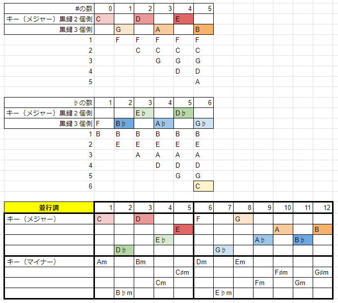

# KeySignature
楽譜に調号、すなわち、ト音記号の横に「#」や「♭」の記号があった時、その数から、その曲が「何調なのか」が、すぐに分かります。  
とはいえ、これを丸暗記で覚えるのは難しいです。  
理屈はともかく、キーや調号の出現する順序を俯瞰的に眺めて、その法則性、規則性が分かると、印象に残って暗記しやすいので、その考え方を以下にまとめてみました。  

## 1.覚え方（なぜそうなるかは「2.」以降）
1. 「#」が付くのは1個から5個まで。  
2. 「♭」が付くのは1個から6個まで。  
3. 調号がつかない場合（Cメジャー/Aマイナー）と合わせて、全部で12通り。  
4. 「#」と「♭」が混在することはない。  
5. 「#」が１個だけ付くのは、「Gメジャー/Eマイナー」、鍵盤の場所をイメージ。  
6. 「#」が0個から増えるにしたがって、メジャーキーは「C、G、D、A、E、B」となる。  
7. 0個、2個、4個なら「C、D、E」で、1個、3個、5個なら「G、A、B」である。
8. 「C、G、D、A、E、B」は、ピアノの鍵盤でいえば、「黒鍵２個側」「黒鍵３個側」の白鍵に交互に昇順に現れている。  
9. 「♭」が１個だけ付くのは、「Fメジャー/Dマイナー」、鍵盤の場所をイメージ。  
10. 「♭」が1個から増えるにしたがって、メジャーキーは「F、B♭、E♭、A♭、D♭、G♭」となる。  
11. 3個、5個であれば「E♭、D♭」で、1個、2個、4個、6個であれば「F、B♭、A♭、G♭」である。
12. 「F、B♭、E♭、A♭、D♭、G♭」は、ピアノの鍵盤でいえば、「黒鍵３個側」「黒鍵２個側」に交互に降順に現れている。  
13. 「#」や「♭」が増えていくとき、「それまでに調号がついた音」に上乗せで、調号がつく音が増える。  
  - 「#」が付く音：「F」→「F」+「C」→「FC」+「G」→「FCG」+「D」→「FCGD」+「A」  
  - 「♭」が付く音：「B」→「B」+「E」→「BE」+「A」→「BEA」+「D」→「BEAD」+「G」→「BEADG」+「C」  
14. 「平行調」は、メジャーキーの短３度下のマイナーキーだが、「短３度下」は、ピアノの鍵盤でいえば、「白鍵をひとつ飛ばしで２つ押さえる時」に、「間に黒鍵が１個だけある場合」である。  
15. 平行調でどちらにも調号がつかないのは、具体的には「Am -> C」、「Bm -> D」、「Dm -> F」、「Em -> G」の４通り。
16. 「どちらかに調号が付く平行調」は、暗記せず、「メジャーキーの短３度下がマイナーキー」から導けばよい。  
  
- 一覧イメージ図  

  
## 2.まず「黒鍵」を１回だけ使うキーを探す
ピアノの鍵盤で、「ドレミファソラシド」（メジャー）と弾いてみましょう。  
通常は「ド」を「C」からはじめて、白鍵のみで弾くでしょう。  
このような、白鍵だけを使い、黒鍵を使わないキーは、Cメジャー/Aマイナーだけです。  
では次に、  
- 「ド」を移動させて、「C」以外から弾きはじめて、黒鍵を１回しか使わないキー  
  
が何通りあるか、探してみましょう。  
「ドレミ」の音程は、「全音」+「全音」ですね。  
「CD」の間にも、「DE」の間にも、いずれにも「黒鍵」があります。  
まずはこのような、「いずれの間にも黒鍵がある、隣接した３音」がないかと見渡すと、ほかに２か所あります。  
「FGA」と「GAB」です。  
それぞれ、くわしく観察してみましょう。  
  
## 3.「GAB」をよく観察する
「GAB」から試しに白鍵で７つ弾いてみると、「GABCDE」まで、「ドレミファソラ」と聞こえます。  
ところが「ラシ」の「EF」のところだけ、違和感があります。  
違和感なく「ドレミファソラシド」と聞こえるためには、「GABCDE」「F#」と弾く必要があります。  
「#」が１回だけ、「F」につくわけです。  
- 「G」を「ド」とみる「Gメジャー」は、「黒鍵」を１回だけ使うキー  
  
のようです。  
「G」を「ド」とみると、「F」は「シ」です。  
下降で「ドシ」と弾くとき、半音下がるはずなのに、「GF」だと全音下がってしまうので、これを半音にするためには、「GF#」とするわけです。
  
## 4.「FGA」をよく観察する
次に「FGA」から白鍵で７つ弾いてみると、「FGA」まで、「ドレミ」と聞こえますが、「AB」のところで、「ミファ」ではない、違和感があります。  
違和感なく「ドレミファ」と聞こえるためには、「FGA」「B♭」と弾く必要があります。  
それ以降の「CDEF」は、「ソラシド」と聞こえます。  
「♭」が１回だけ「B」につくわけです。  
- 「F」を「ド」とみる「Fメジャー」も、「黒鍵」を１回だけ使うキー  
  
のようです。  
「F」を「ド」とみると、「B」は「ファ」です。  
上昇で「ミファ」と弾くとき、半音上がるはずなのに、「AB」だと全音上がってしまうので、これを半音にするためには、「AB♭」とするわけです。  
  
## 5.ここまでのまとめ
「黒鍵」を１回だけ使うキーには、「#」が１回だけ付くものと、「♭」が１回だけ付くもの、の２通りある。  
それは、  
1. 楽譜に調号「#」が１つだけ付く場合＝Gメジャー（ト長調）（「#」は「F」（移動シ）に付く）
2. 楽譜に調号「♭」が１つだけ付く場合＝Fメジャー（ヘ長調）（「♭」は「B」（移動ファ）に付く）
  
この２つは、とにかく暗記してしまいましょう。  
ピアノの鍵盤で、「白鍵で「長３度」なところ」の３か所（C->E）（F->A）（G->B）が、スタート地点です。
  
## 6.「#」が付く数ごとのメジャーキーの一覧
範囲を広げていきます。  
「#」が付く場合を、メジャーキー（長調）のみで考えます。  
- 「#」が１つ付く場合＝Gメジャー（ト長調）
- 「#」が２つ付く場合＝Dメジャー（ニ長調）
- 「#」が３つ付く場合＝Aメジャー（イ長調）
- 「#」が４つ付く場合＝Eメジャー（ホ長調）
- 「#」が５つ付く場合＝Bメジャー（ロ長調）
  
の５通りあります。  
ちなみに、ピアノの鍵盤をイメージすると、１オクターブのなかに黒鍵は５個しかないから、「#」が５つ付くBメジャーというのは、黒鍵を５つとも全部使う場合です。  
以上を踏まえて、「#」の数とキーの並びの覚え方を考えましょう。  
- ①CからEまでの「黒鍵２個側」  
- ②FからBまでの「黒鍵３個側」  
  
に２分して考えると、「#」が１つ増えるごとに、キーは「黒鍵２個側」と「黒鍵３個側」に交互に、昇順に現れます。  
- メジャーキー
  - ①側：C_D_E  
  - ②側：_G_A_B  
  
イメージできるでしょうか。  
さらに、「#」が付く音も、「黒鍵２個側」と「黒鍵３個側」に交互に、昇順に現れて、積み上げていく感じです。  
- 「#」が付く音
  - ①側：_C_D  
  - ②側：F_G_A  
  
「#」が０＝Cメジャー（ハ長調）も含めると、以下の表のようになります。
  
| 「#」の数           | 0 | 1 | 2 | 3 | 4 | 5 |
|---------------:|---|---|---|---|---|---|
| メジャーキー黒鍵２個側 | C |   | D |   | E |   |
| メジャーキー黒鍵３個側 |   | G |   | A |   | B |
| ②「#」のつく場所1 |   | F | F | F | F | F |
| ①「#」のつく場所2 |   |   | C | C | C | C |
| ②「#」のつく場所3 |   |   |   | G | G | G |
| ①「#」のつく場所4 |   |   |   |   | D | D |
| ②「#」のつく場所5 |   |   |   |   |   | A |
  
## 7.「♭」が付く数ごとのメジャーキーの一覧
次に、「♭」が付く場合を、同じくメジャーキー（長調）のみで考えます。  
- 「♭」が１つ付く場合＝Fメジャー（ヘ長調）
- 「♭」が２つ付く場合＝B♭メジャー（変ロ長調）
- 「♭」が３つ付く場合＝E♭メジャー（変ホ長調）
- 「♭」が４つ付く場合＝A♭メジャー（変イ長調）
- 「♭」が５つ付く場合＝D♭メジャー（変ニ長調）
- 「♭」が６つ付く場合＝G♭メジャー（変ト長調）
  
の６通りあります。  
ピアノの鍵盤をイメージすると、１オクターブのなかに黒鍵は５個しかないのに、「♭」が６つ付くG♭メジャーというのは、どういうことでしょうか。  
黒鍵を全部使ったうえにさらに、「ファ」にあたる「B」が、白鍵を弾くのに、実は「C♭」なのです。  
以上を踏まえて、「♭」の数とキーの並びの覚え方を考えましょう。  
- ①CからEまでの「黒鍵２個側」  
- ②FからBまでの「黒鍵３個側」  
  
に２分して考えると、「♭」が１つ増えるごとに、キーは「黒鍵２個側」と「黒鍵３個側」に交互に、降順に現れます。  
- メジャーキー
  - ①側：_ _E♭_D♭  
  - ②側：F B♭_A♭_G♭  
  
「♭」が付く音も、「黒鍵２個側」と「黒鍵３個側」に交互に、降順に現れて、積み上げていく感じです。  
- 「♭」が付く音
  - ①側：_E_D_C  
  - ②側：B_A_G  
  
「#」が付くときは昇順に交互であったが、「♭」が付くときは降順に交互であるのと、「C♭」というのは弾くときには「B」を弾く、というのがポイントです。  
まとめると以下の表のようになります。  
  
| ♭の数           | 1 | 2  | 3  | 4  | 5  | 6  |
|---------------:|---|----|----|----|----|----|
| メジャーキー黒鍵２個側 |   |    | E♭ |    | D♭ |    |
| メジャーキー黒鍵３個側 | F | B♭ |    | A♭ |    | G♭ |
| ②「♭」のつく場所1 | B | B  | B  | B  | B  | B  |
| ①「♭」のつく場所2 |   | E  | E  | E  | E  | E  |
| ②「♭」のつく場所3 |   |    | A  | A  | A  | A  |
| ①「♭」のつく場所4 |   |    |    | D  | D  | D  |
| ②「♭」のつく場所5 |   |    |    |    | G  | G  |
| ①「♭」のつく場所6 |   |    |    |    |    | C  |
  
## 8.平行調の対応表
平行調は、ペンタトニックでよく取り上げられる「Aマイナー」と「Cメジャー」のような、構成音が同一である長調と短調のペアのことです。  
  
- 平行調の組み合わせには、「1.長短どちらにも調号が付かない」「2.マイナーにだけ「#」が付く」「3.メジャーにだけ「♭」が付く」「4.長短どちらにも「♭」が付く」の４通りがある
- メジャーキーから「全音」＋「半音」（＝半音３つ分、ギター指板なら３フレット）だけ下がったところが、マイナー平行調のキー
- 楽譜の調号からキーを見つける際は、まずはメジャーキーなら何か、を考えて、マイナーキーはその短３度下、と考えると、覚えたり考えたりする量が少なくて済む
- 例えばよく使われる「Aマイナー」と「Cメジャー」のキー音は、ギターでペンタトニックを弾く際に、６弦５フレット「A」と同８フレット「C」に現れている
  
以上をふまえて、平行調の組み合わせを１２音順に一覧にすると以下のとおり。  
  
| 並行調      | 1  | 2   | 3  | 4  | 5   | 6  | 7   | 8  | 9  | 10  | 11 | 12  |
|----------:|----|-----|----|----|-----|----|-----|----|----|-----|----|-----|
| １． | C  |     | D  |    |     | F  |     | G  |    |     |    |     |
| ２． |    |     |    |    | E   |    |     |    |    | A   |    | B   |
| ３． |    |     |    | E♭ |     |    |     |    | A♭ |     | B♭ |     |
| ４． |    | D♭  |    |    |     |    | G♭  |    |    |     |    |     |
| マイナーキー | Am |     | Bm |    |     | Dm |     | Em |    |     |    |     |
|          |    |     |    |    | C♯m |    |     |    |    | F♯m |    | G♯m |
|          |    |     |    | Cm |     |    |     |    | Fm |     | Gm |     |
|          |    | B♭m |    |    |     |    | E♭m |
  
## 9.まとめ
楽譜の調号からキーを見つける際は、以下を暗記し、たどっていって判定する。
  
1. 楽譜に調号「#」が１つだけ付く場合＝Gメジャー（ト長調）（「#」は「F」（移動シ）に付く）
2. 楽譜に調号「#」が増えるたびに、メジャーキーは、「C」「G」「D」「A」「E」「B」となる。（鍵盤上の出現場所、出現順をイメージすること！）
3. 楽譜に調号「♭」が１つだけ付く場合＝Fメジャー（ヘ長調）（「♭」は「B」（移動ファ）に付く）
4. 楽譜に調号「♭」が増えるたびに、マイナーキーは、「F」「B♭」「E♭」「A♭」「D♭」「G♭」となる。（鍵盤上の出現場所、出現順をイメージすること！）
5. 平行調は、「メジャーキー」の「短３度下」が「マイナーキー」
  
以上。